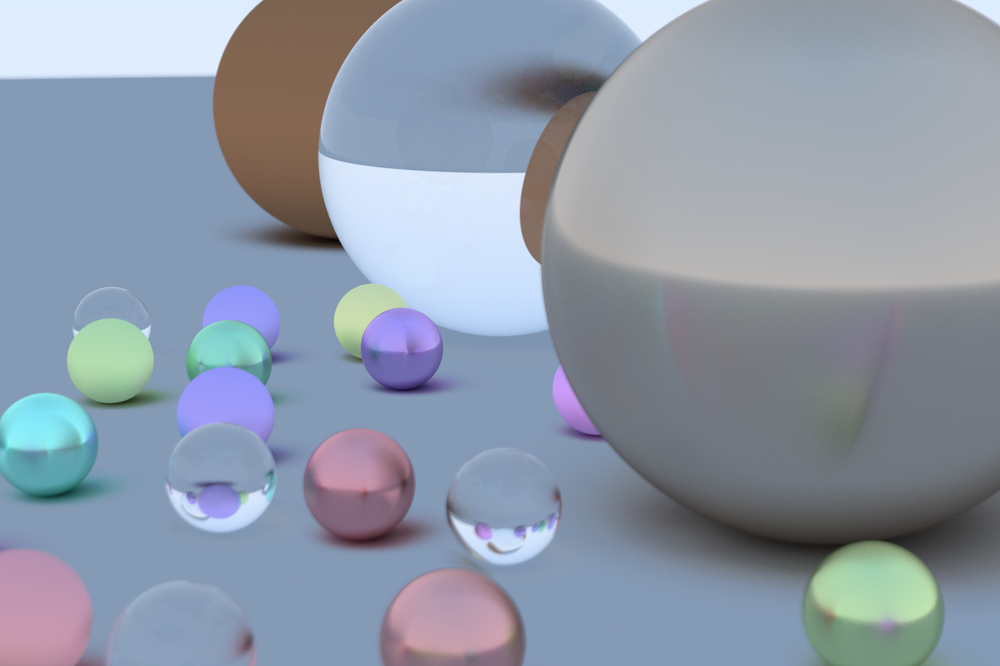

# Ray Tracing in One Weekend

This is my attempt at implementing a raytracer in Rust follow the [Ray Tracing in One Weekend](https://raytracing.github.io/books/RayTracingInOneWeekend.html) guide. It came out okay! Rust is great.

